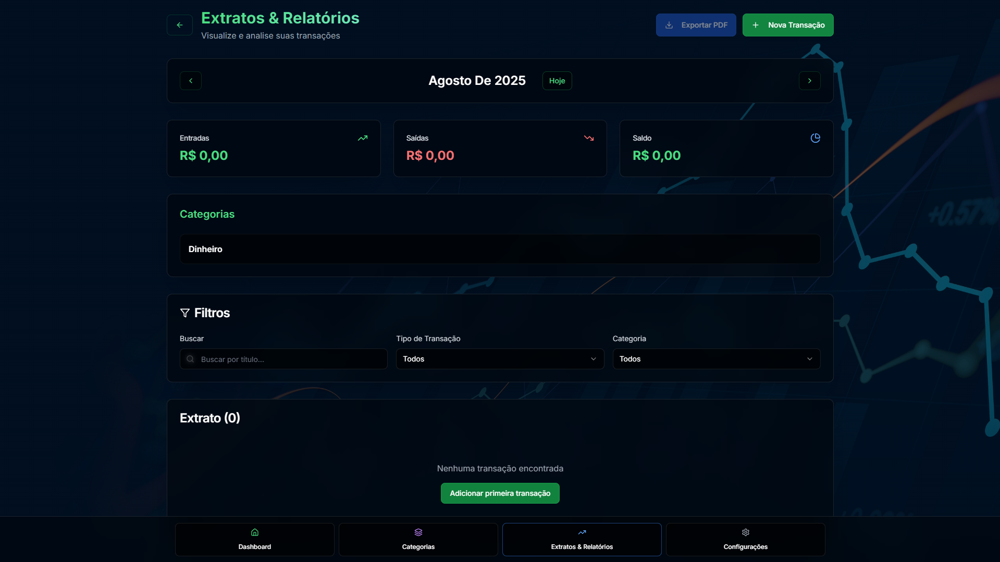
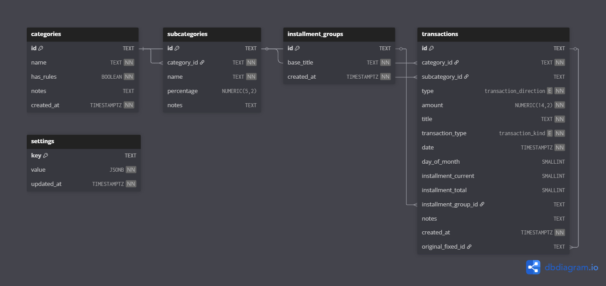

# Easy Expenses

😵‍💫 Perdido nas finanças ou sem saber para onde o dinheiro vai? Chega de planilhas complicadas!

Easy Expenses é um app de código aberto que nasceu de uma necessidade pessoal: organizar e acompanhar gastos de forma simples, visual e sem complicação. O objetivo é te ajudar a tomar decisões com mais clareza.

### ✨ Por que usar o Easy Expenses?

- ✅ **Simples e rápido:** Registre despesas, receitas e transferências em segundos.
- 📊 **Visual:** Entenda para onde seu dinheiro está indo com gráficos interativos.
- 🎯 **Organizado:** Crie categorias e regras (como 50/30/20) para planejar seu orçamento.
- 🔒 **Privado e Offline:** Seus dados ficam apenas no seu dispositivo. Sem nuvem, sem login.
- 📄 **Relatórios em PDF:** Exporte um resumo mensal para guardar ou compartilhar.
- 🌐 **Multi-idioma:** Disponível em português, inglês e espanhol.

### 🚀 Como começar

1. **Teste agora:** [**jhermesn.dev/easyExpenses**](https://jhermesn.dev/easyExpenses)
2. **Instale o PWA:** Para uma experiência de app nativo no celular ou desktop.
3. **Organize e acompanhe:** Crie suas categorias, adicione transações e veja a mágica acontecer!

> **Dica:** Há uma página de **Ajuda & Glossário** no app explicando todos os termos.

### 💬 Contribua e faça parte

Este é um projeto de código aberto e sua ajuda é muito bem-vinda!

- ⭐ **Achou útil?** Deixe uma estrela no repositório.
- 💡 **Tem uma ideia?** Abra uma [Issue](https://github.com/jhermesn/easyExpenses/issues).
- 🛠️ **Quer contribuir?** Envie um [Pull Request](https://github.com/jhermesn/easyExpenses/pulls).
- 🗣️ **Pode ajudar alguém?** Compartilhe com sua rede.

### Autor

- [Jorge Hermes](https://jhermesn.dev)

### Licença

Este projeto está licenciado sob **CC BY-NC-SA 4.0**. Consulte o arquivo [LICENSE](./LICENSE) para o texto completo da licença. Saiba mais em `https://creativecommons.org/licenses/by-nc-sa/4.0/`.